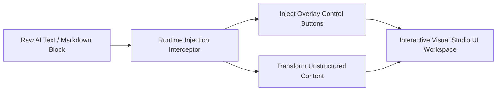
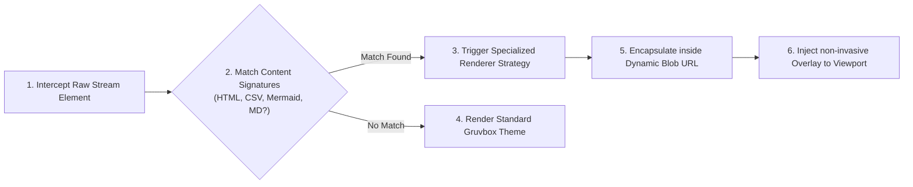

# README: Gemini Ultimate (v6.0 Industrial UX)

Gemini Ultimate is an enterprise-grade presentation layer and interactive rendering engine designed for `gemini.google.com`. It transforms raw AI outputs into developer-friendly, high-efficiency visual workspaces through a non-invasive runtime injection layer.

---

## ⚡ Quick Start (Minimal Viable Example)

For users who have never interacted with this codebase, you can think of this tool as an automated, client-side visual interceptor. Once installed via Tampermonkey or Violentmonkey, it hooks into the DOM rendering cycle seamlessly.

Below is an abstract behavioral representation (BDD Model) demonstrating how the script handles unstructured user communications and raw Markdown code blocks:



---

## 🎯 Behavioral Feature Mapping (BDD Specification)

To quickly build a mental model for developers new to this codebase, the system features are organized below using a strict Behavior-Driven Development (BDD) structure (**Given-When-Then**). This outlines exactly how users interact with the system and what output behavior is guaranteed.

| Target Component | Given (User Context) | When (Action/Trigger) | Then (Expected Outcome) | Industrial Highlight |
| --- | --- | --- | --- | --- |
| **Interactive HTML Workspace** | A raw HTML/JS text chunk is rendered in a chat bubble. | The developer clicks the `▶️ Render Web` button. | A fully sandboxed `<iframe>` materializes, loading the app via an isolated Blob URL. | Bypasses strict host CSP regulations deterministically without server-side relays. |
| **Mermaid Diagram Studio** | A structured flowchart, sequence diagram, or mindmap block appears. | The developer clicks `🎨 Interactive Diagram`. | The raw script compiles into a vector canvas supporting matrix translation (pan, zoom, pinch). | Includes a single-click serialization bridge syncing data directly to `mermaid.live`. |
| **RFC 4180 Datatable Engine** | A continuous stream of comma-separated (CSV) plain text is output. | The developer clicks the `📊 Data Table` toggle button. | A deterministic, zero-dependency engine instantly processes cells into a tabular grid. | Complete text-wrapping defense prevents overflow rendering bugs on small displays. |
| **Markdown Preview Engine** | A code container tagged with `md` or `markdown` is identified. | The developer activates `📝 MD Preview`. | An asynchronous module lifecycle fallback imports `Marked.js` to render rich typography. | Safe DOM transformation using trusted script injection routines. |
| **Data Ink Optimization** | A massive structured dataset table spans across the vertical viewport. | The developer scrolls down or hovers over specific cells. | Table headers lock to the top via frosted-glass layers, and row/column crosshairs illuminate. | Eradicates multi-axis scanning drift on ultra-wide desktop monitors. |
| **Smart Interface Capsule** | The interface container is left idling without text inputs. | The operator scrolls down or swipes away from the input frame. | The input area smoothly condenses down into a high-visibility, rounded mobile capsule. | Maximizes visual real estate; automatically re-expands upon mouse-down or panel focus. |

---

## 🗺️ Architectural Control Flow

When a payload is injected into the interface, data flows linearly through a decoupled transformation pipeline:



---

## 📁 Codebase Directory Roadmap

To navigate the codebase efficiently without deep prior exposure, refer to this structural directory layout mapping features to physical code locations:

```
├── .gitignore              # Dependency and environment asset filters
├── package.json            # Runtime tooling, script configurations, and dev dependencies
├── tsconfig.json           # Type resolution boundaries and compilation targets
├── vite.config.ts          # Environment variables mapping (GEMINI_API_KEY resolution rules)
└── gemini-ultimate.user.js # Unified core entry point (Meticulously isolated via IIFE)
    ├── § 0 Base Config     # Global thresholds, animation bounds, and CDN configurations
    ├── § 1 Trusted Types   # Security layer guarding against client-side XSS vectors
    ├── § 2 CSS Injection   # Industrial Gruvbox & VS2022 Hybrid style compiler
    ├── § 3 Network Wrapper # Asynchronous resource management pipelines with automatic retries
    ├── § 4-6 Mermaid Core  # Standalone HTML builders and gesture translation mechanics
    ├── § 7-9 Core Strategy # Multi-Renderer pipeline state machine (HTML, Markdown, CSV)
    ├── § 10-11 Core Utils  # Radial menu bindings, toast messaging, and state persistence rules
    └── § 12-13 Observers   # Debounced MutationObserver scanning thread-blocking mitigations

```

---

## ⚙️ Technical Assembly & Deployment Requirements

* **Host Engine Environment**: Tampermonkey[https://chromewebstore.google.com/detail/tampermonkey/dhdgffkkebhmkfjojejmpbldmpobfkfo?hl=zh-TW&pli=1] / Violentmonkey Engine (Desktop & Mobile)
* **Execution Boundary Priority**: Registered at `document-start`
* **External Network Connectivity Allowlist**: `cdn.jsdelivr.net`, `unpkg.com`, `cdnjs.cloudflare.com`, `esm.sh`, `image.pollinations.ai`