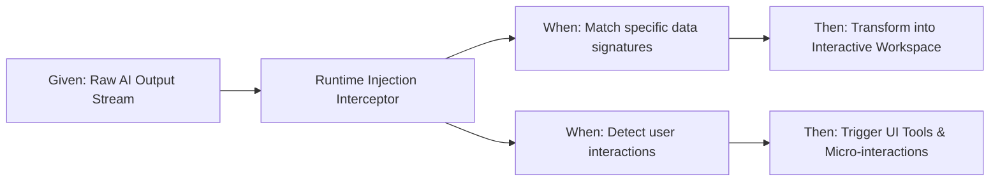
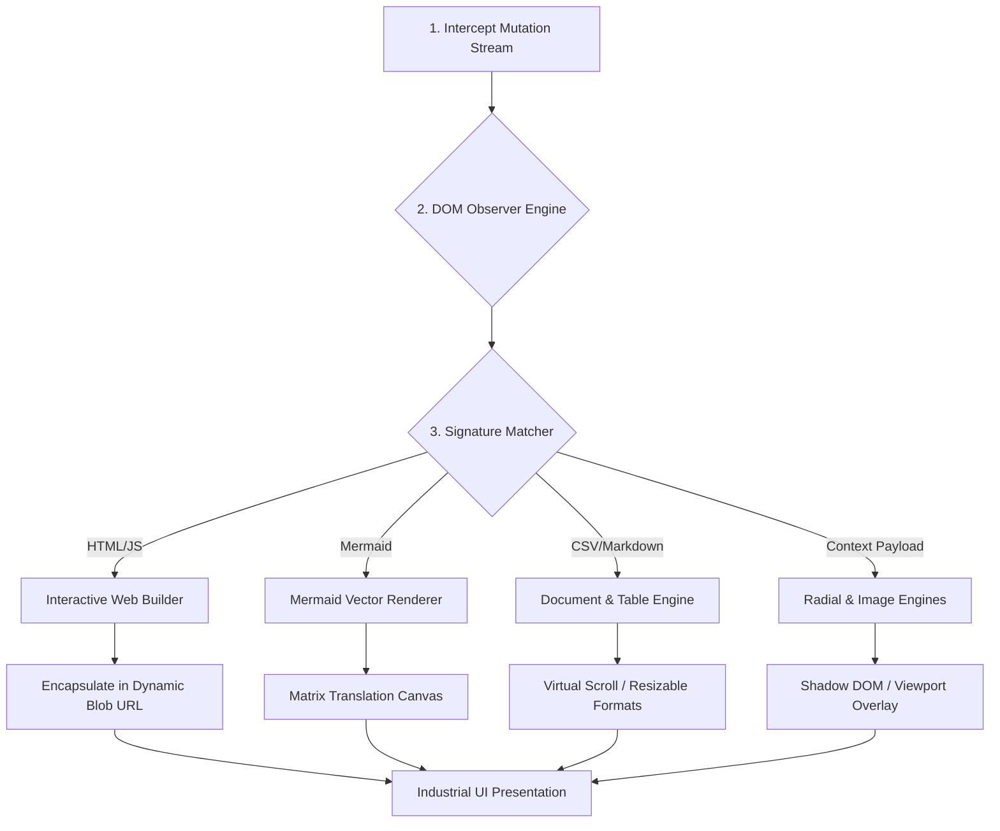

# README: Gemini Ultimate (v6.0 Industrial UX)

Gemini Ultimate is an enterprise-grade presentation layer and interactive rendering engine designed for `gemini.google.com`. It transforms raw AI outputs into developer-friendly, high-efficiency visual workspaces through a non-invasive runtime injection layer.

---

## ⚡ Quick Start (Minimal Viable Example)

For users who have never interacted with this codebase, you can think of this tool as an automated, client-side visual interceptor. Once installed via Tampermonkey or Violentmonkey, it hooks into the DOM rendering cycle seamlessly.

Below is an abstract behavioral representation (BDD Model) demonstrating how the script processes unstructured user communications and code blocks:



---

## 🎯 Behavioral Feature Mapping (BDD Specification)

To quickly build a mental model for developers new to this codebase, the system features are organized below using a strict Behavior-Driven Development (BDD) structure (**Given-When-Then**). This outlines exactly how users interact with the system and what output behavior is guaranteed.

| Target Component | Given (User Context) | When (Action/Trigger) | Then (Expected Outcome) | Industrial Highlight |
| --- | --- | --- | --- | --- |
| **Interactive Web Workspace** | A raw HTML/JS/CSS text chunk is rendered in a chat bubble. | The developer clicks the `▶️ Render Web` button. | A full `<iframe>` sandbox materializes, loading the app via an isolated Blob URL. | Bypasses strict host CSP regulations deterministically without server-side relays. |
| **Mermaid Diagram Studio** | A structured flowchart, sequence diagram, or mindmap block appears. | The developer clicks `🎨 Interactive Diagram`. | The raw script compiles into a vector canvas supporting matrix translation. | Includes robust gesture controls (pan, zoom, pinch) and a serialization bridge to `mermaid.live`. |
| **AI Image Generator** | An image generation payload or query is detected. | The developer triggers the image generation command. | An asynchronous API call dynamically injects a high-res image into the chat view. | Zero-configuration Pollinations API integration leveraging background requests. |
| **Radial Context Menu** | The operator highlights text or triggers the interactive menu. | The user presses the trigger shortcut or action. | A circular, gesture-friendly wheel menu appears offering smart contextual tools. | Frictionless UX inspired by high-end gaming and professional CAD software. |
| **Private GEMs Menu** | The user requires consistent, fine-tuned expert AI personas. | The user selects a specific role from the custom GEMs extension menu. | An engineered payload prompt is instantly injected into the input container. | Eliminates prompt switching friction; centrally managed directly in the presentation layer. |
| **RFC 4180 Datatable Engine** | A continuous stream of tabular or CSV plain text is output. | The developer clicks the `📊 Data Table` toggle button. | A deterministic engine instantly processes cells into a scalable interactive grid. | Includes draggable column resizers (Excel-like) and text-wrap overflow defenses. |
| **Data Ink Optimization** | A massive structured dataset table spans across the viewport. | The developer scrolls down or hovers over specific data cells. | Table headers lock to the top via frosted-glass, and row/column crosshairs illuminate. | Eradicates multi-axis scanning drift on ultra-wide desktop monitors. |
| **Smart Interface Capsule** | The interface container is left idling without text inputs. | The operator scrolls down or clicks entirely outside the input frame. | The input area smoothly condenses down into a high-visibility, rounded mobile capsule. | Maximizes screen real estate; automatically re-expands with precise physics on focus. |
| **State & Virtual Routing** | The DOM navigates through heavy repaints or session reloads. | The user opens previously modified interactive views or content blocks. | Skeleton loaders mask the UI delay, and previous expanded/collapsed states are restored. | Implements a robust `GM_getValue` caching layer with timeline state expirations. |

---

## 🗺️ Architectural Control Flow

When a payload is injected into the interface, data flows linearly through a decoupled transformation pipeline:



---

## 📁 Codebase Directory Roadmap

To navigate the codebase efficiently without deep prior exposure, refer to this structural directory layout mapping features to physical code locations:

```text
├── .gitignore              # Dependency and environment asset filters
├── package.json            # Runtime tooling, script configurations, and dev dependencies
├── tsconfig.json           # Type resolution boundaries and compilation targets
├── vite.config.ts          # Environment variables mapping (API key resolution rules)
└── gemini-ultimate.user.js # Unified core entry point (Meticulously isolated via IIFE)
    ├── § 0 Base Config     # Global thresholds, custom GEMs configurations, animation bounds
    ├── § 1 Trusted Types   # Security layer guarding against client-side XSS vectors
    ├── § 2 CSS Injection   # Industrial Gruvbox & VS2022 Hybrid style compiler
    ├── § 3 Network Wrapper # Asynchronous resource management pipelines with automatic retries
    ├── § 4-6 Mermaid Core  # Standalone HTML builders, canvas matrix, and gesture translation
    ├── § 7-8 Core Tools    # Interactive HTML Blob rendering and Pollinations Image Generator
    ├── § 9-11 UI Elements  # DOM injection for buttons, Radial Menu, Toast configs, and GEMs 
    └── § 12-13 Observers   # Debounced MutationObserver and Shadow DOM scanning optimizations
```

---

## ⚙️ Technical Assembly & Deployment Requirements

* **Host Engine Environment**: Tampermonkey / Violentmonkey Engine (Desktop & Mobile)
* **Execution Boundary Priority**: Registered at `document-start`
* **External Network Connectivity Allowlist**: `cdn.jsdelivr.net`, `unpkg.com`, `cdnjs.cloudflare.com`, `esm.sh`, `image.pollinations.ai`
